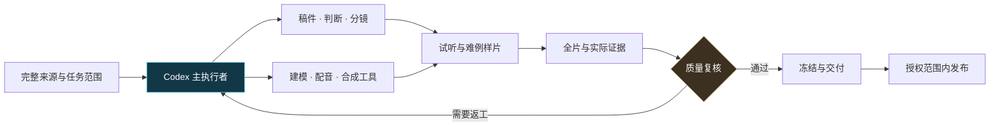

# Codex · 产业链 3D 视频制作 SOP

**让 Codex 把完整产业研究稿，变成讲得明白、拆得清楚、可编辑的 3D 视频。**

从产品用途出发，沿结构与工艺拆到技术瓶颈、公司竞争和赚钱机制。Codex 贯穿读源、写稿、分镜、建模脚本、配音与渲染调度、问题修复、质量证据和交付。

<p align="center"><strong>Codex 主导</strong> · 产品真实拆解 · 先样片后全片 · 12 项质量证据 · MIT 开源</p>

[一键安装](#一键安装到-codex) · [快速开始](#快速开始) · [Codex 工作流](docs/codex-workflow.md) · [完整制作 SOP](docs/production-sop.md) · [视觉示例](#视觉示例) · [任务模板](templates/next-episode/README.md) · [隐私检查](docs/publication-review.md)

## 你会得到什么

| 从哪里出发 | 怎样制作 | 怎样交付 |
|---|---|---|
| 指定完整原文、产品范围与来源证据 | Codex 规划、实现并调度专业工具 | 可编辑工程、成片和对应质量证据 |
| 每层有明确用途、瓶颈和公司判断 | 真实分件展开、短环绕、合体和功能近景 | 同源稿件、音轨、字幕、封面及发布包 |
| 自有品牌与获授权音色 | 先试听与难例样片，再投入长渲染 | 实际未验范围、修改依赖和可恢复记录 |

仓库提供可安装的 Codex 技能、依赖安装器、环境自检、任务初始化工具，以及中文 SOP、模板、布局和示意素材。复杂制作运行器与平台发布插件仍需按[适配说明](docs/tool-adapters.md)接入。

## 一键安装到 Codex

**把下面这句发给 Codex 即可：**

```text
请把 https://github.com/shao60533/industry-chain-3d-video-sop 安装为 industry-chain-3d-video 技能，使用统一安装器准备 Blender、FFmpeg、独立 Python 环境和中文字体，并完成实际渲染/编码自检。
```

也可在 macOS/Linux 终端执行：

```bash
curl -fsSL https://raw.githubusercontent.com/shao60533/industry-chain-3d-video-sop/main/install.sh | bash
```

安装器复用已有工具，自动补齐缺失依赖；不会索取 token、上传音色或配置平台账号。Windows PowerShell、离线工具配置、版本选择与权限说明见 [完整安装指南](docs/installation.md)。安装后在下一个 Codex 回合使用 **`$industry-chain-3d-video`**。

## 快速开始

1. 打开 [Codex 工作流](docs/codex-workflow.md)，复制其中的启动任务，填入自己的产品、完整来源、品牌、工作目录与实际工具。
2. 把 [下一集模板](templates/next-episode/README.md) 复制到本地 `jobs/<job-id>/`。默认 `produce_only`，账号、音色、来源与所有验收结果等待实际填写。
3. 让 Codex 先读完整来源、写一层完整判断和全期结构，再制作配音试听、三类产品图、开场与正文难例样片。
4. 样片达到要求后进入全片；按 [质量验收](docs/acceptance.md) 检查最终编码、声音、运动、布局和真实设备。
5. 需要发布时按 [发布 SOP](docs/publication-sop.md) 核冻结资产、账号和实际授权，再通过自行验证的适配器单次提交。

> **模板不是成片，也不是通过证明。** `null / false / pending` 表示待填或待验。Codex 自检如实记录为 `self_review`；实听、连续播放和设备检查以实际能力与证据为准。

## Codex 怎样贯穿流程



专业工具负责具体计算和操作，Codex 维护任务与依赖，实际复核者确认声音、动态与设备效果。可选模型用于明确分配的子任务。默认分工、提示词和目录约定见 [AGENTS.md](AGENTS.md) 与 [Codex 工作流](docs/codex-workflow.md)。

## 视觉示例

这些是从已有原创素材中选出的纯渲染预览。它们展示分层结构、近景与材料组织，作为方法示例；每期仍需核自己的产品依据和成片质量。

<table>
<tr>
<td align="center"><br><strong>分层展开</strong><br>盖板、裸片、基板与焊球的空间关系</td>
<td align="center"><br><strong>进入功能细节</strong><br>焊盘、器件、布线与连接落点</td>
</tr>
<tr>
<td align="center"><br><strong>材料与装配</strong><br>外壳让开，内部结构成为观察入口</td>
<td align="center"><br><strong>功能近景</strong><br>驱动、承力、紧固与接口的可见关系</td>
</tr>
</table>

封面是新生成的概念插图；上述产品图为通用建模示意，不能用来声明厂商 CAD、实际工艺剖面或真实供应关系。素材来源类别、尺寸、许可与处理方式见 [素材说明](assets/README.md) 和 [图解方法](docs/visual-examples.md)。

## 一期视频的 A–H 工作流

| 阶段 | Codex 推进的工作 | 核心产物 |
|---|---|---|
| **A · 来源** | 完整读源、锁版本、判断范围与缺口 | 原文快照、SHA、brief、来源映射 |
| **B · 稿件** | 用途→门槛→瓶颈→公司竞争→盈利，问答成对 | MD/TXT/JSON、公司判断、稿件锁 |
| **C · 设计** | 产品参考、三类图、分镜、封面和音乐 cue | 设计锁、shot-map、布局与字体锁 |
| **D · 音轨** | 调度获授权音色，试听、配音和重对齐 | WAV、voice-lock、timing、SRT |
| **E · 模型** | 原生分件、语义节点、连续展开/环绕/合体 | 可编辑工程、开场和正文难例 |
| **F · 全片** | 渲染、合成、编码、逐帧日志与实际复核 | MP4、layout、技术与听看证据 |
| **G · 冻结** | 核12项报告及全依赖，记录真实交付状态 | production-spec、报告、资产 manifest |
| **H · 发布** | 核授权与账号、唯一草稿、单次提交与归档 | attempt/result、原始回执和状态台账 |

### 先把最难的 30 秒做好

- **配音试听：** 30–60 秒，包含公司名、数字、缩写和判断句。
- **开场：** 8–10 秒，节奏音乐推动真实展开、短环绕与合体，音效点缀落点。
- **正文难例：** 15–30 秒，同时检验功能动作、两行字幕、数据卡和图注。
- **观看尺寸：** 200/390px 对照产品焦点，360/390px 检查编码遮罩，真实设备另验。

封面可独立设计或生成；正文图、模型和动作保持对应。字幕透明背景、最多两行；关键字形、数字和正在解释的部件避开卡片及平台 UI。语速、BPM、拆集和时长按当前实际样片决定。

## 五道质量关口


技术通过、布局通过、发布就绪、已提交、审核中和已公开分别记录。12 项证据绑定当前文件 SHA；缺项或 `pending` 时交本地待验审阅包。改稿、音轨、字体、模型、封面或编码，按依赖决定重验范围。

## 文档导航

| 想完成的事 | 文档 |
|---|---|
| 安装技能与依赖 | [一键安装指南](docs/installation.md) · [技能入口](SKILL.md) |
| 让 Codex 开始执行 | [Codex 工作流与启动任务](docs/codex-workflow.md) |
| 从原稿做完整 3D 视频 | [制作 SOP](docs/production-sop.md) |
| 确定封面、模型和近景品质 | [视觉质量基准](docs/visual-quality.md) · [图解示例](docs/visual-examples.md) |
| 检查逻辑、具体观点和全链覆盖 | [制作复核执行卡](docs/review-checklist.md) |
| 对齐组件、阶段和证据 | [组件契约](docs/component-scope-contract.md) · [质量验收](docs/acceptance.md) |
| 配置工具与平台发布 | [工具适配](docs/tool-adapters.md) · [发布 SOP](docs/publication-sop.md) |
| 交接当前阶段或启动下一集 | [交接契约](docs/handoff.md) · [空白模板](templates/next-episode/README.md) |
| 保护个人信息与凭证 | [隐私规则](SECURITY.md) · [公开前审查](docs/publication-review.md) |

## 工具与配置

准备可编辑 3D 工具（如 Blender）、配音与对齐工具、视频合成工具、FFmpeg/ffprobe 以及实际播放设备。Codex 在当前环境中实现或对接工具；原内部接口名仅用于说明职责，不能作为本仓库已提供的命令。

默认制作起点为 1080×1920、24fps、约5分钟单集。使用自己的完整来源、品牌、账号和获授权音色。`jobs/`、个人音频、凭证、平台日志和原始后台回执保存在本地忽略目录。展示图已重新编码清除元数据，并检查可见内容。

## 开源与贡献

文档、模板、配置及本仓库展示素材采用 [MIT License](LICENSE)。第三方来源、品牌、音乐和音色的使用权另行确认。贡献方法见 [CONTRIBUTING](CONTRIBUTING.md)，版本变化见 [CHANGELOG](CHANGELOG.md)。
