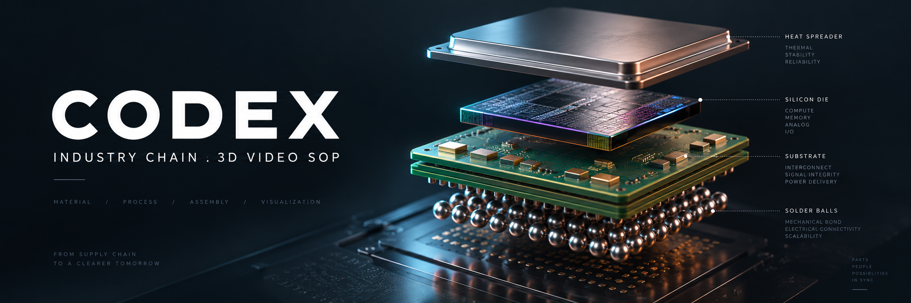
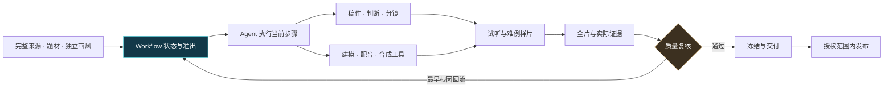
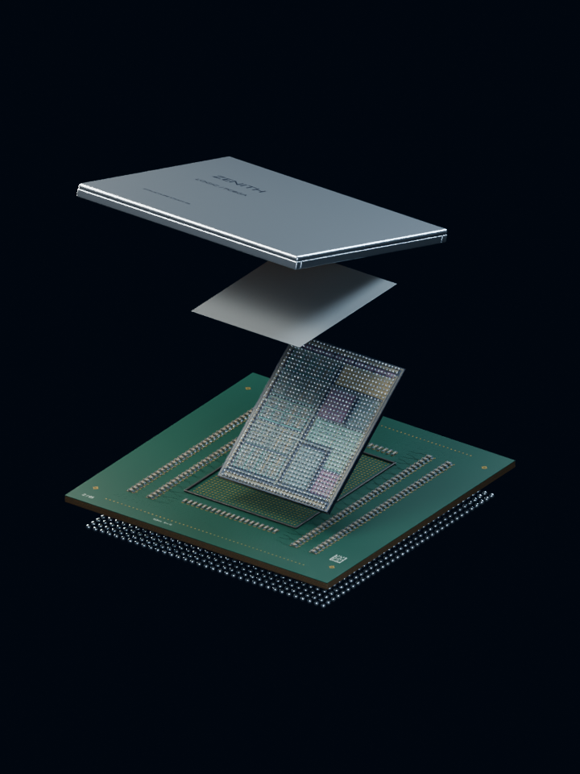
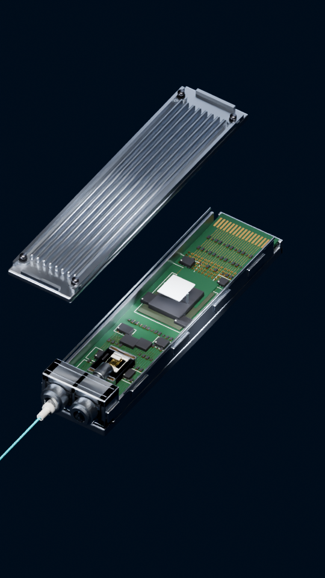
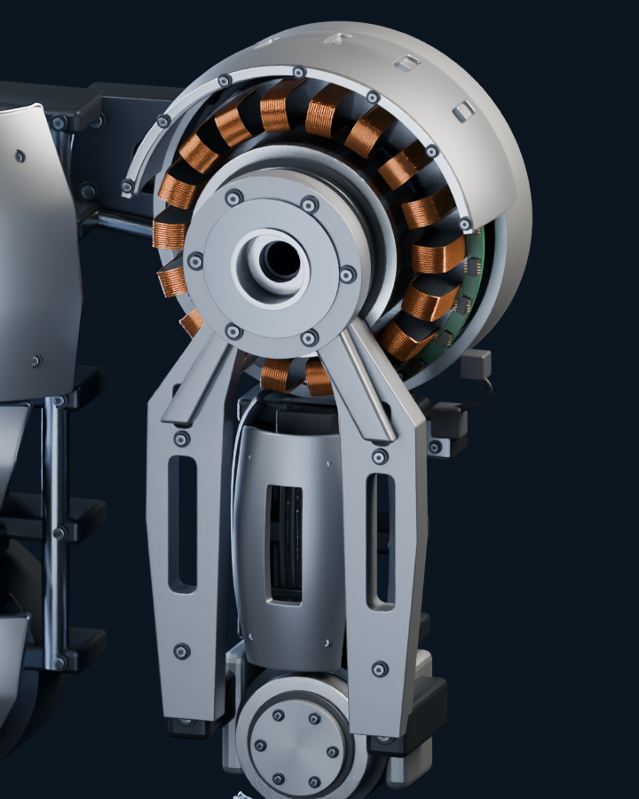

# Codex · 视频制作 Workflow（3D / 白板）

**让 Codex 把完整研究与事实证据，变成讲得明白、可编辑的视频。**

内容题材与画风独立：产业链、财报、催化剂都使用一条 A–H Workflow，均可选 3D 或白板。Agent 执行当前步骤内部工作；Workflow 凭当前版本证据管理准出、失败回流和恢复。产业链的产品拆解方法及 3D 专属质量要求继续保留。

<p align="center"><strong>Codex 主导</strong> · 产品真实拆解 · 先样片后全片 · 12 项质量证据 · MIT 开源</p>

[一键安装](#一键安装到-codex) · [快速开始](#快速开始) · [Codex 工作流](docs/codex-workflow.md) · [完整制作 SOP](docs/production-sop.md) · [视觉示例](#视觉示例) · [任务模板](templates/next-episode/README.md) · [隐私检查](docs/publication-review.md)

## 你会得到什么

| 从哪里出发 | 怎样制作 | 怎样交付 |
|---|---|---|
| 指定完整原文、产品范围与来源证据 | Codex 规划、实现并调度专业工具 | 可编辑工程、成片和对应质量证据 |
| 事实、单位、日期及具体公司判断 | 按画风做3D装配动作或白板图表/关系揭示 | 同源稿件、音轨、字幕、封面及发布包 |
| 自有品牌与获授权音色 | 先试听与难例样片，再投入长渲染 | 实际未验范围、修改依赖和可恢复记录 |

仓库提供可安装的 Codex 技能、依赖安装器、环境自检、任务初始化、持久步骤状态与证据绑定最小核心，以及 SOP、模板和示意素材。核心支持 A–E 本地准出、F 产物登记和12项报告的结构/SHA校验，始终不签发 release_ready；完整制作、checker 与发布运行器仍需按[适配说明](docs/tool-adapters.md)接入。

## 一键安装到 Codex

**把下面这句发给 Codex 即可：**

```text
请把 https://github.com/shao60533/industry-chain-3d-video-sop 安装为 industry-chain-3d-video 技能，使用统一安装器准备 Blender、FFmpeg、独立 Python 环境和中文字体，并完成实际渲染/编码自检。
```

也可在 macOS/Linux 终端执行：

```bash
curl -fsSL https://raw.githubusercontent.com/shao60533/industry-chain-3d-video-sop/main/install.sh | bash
```

安装器复用已有工具，自动补齐缺失依赖；不会索取 token、上传音色或配置平台账号。Windows PowerShell、离线工具配置、版本选择与权限说明见 [完整安装指南](docs/installation.md)。安装后在下一个 Codex 回合使用 **`$industry-chain-3d-video`**。

doctor检查实际中文像素并拒绝缺字方框；最小CPU自检渲染原始Cycles画面，另验工程重开、编码与全解码。可保留自检产物供实际查看，具体命令见安装指南；环境ready不证明GPU、降噪或成片质量。

## 快速开始

1. 打开 [Codex 工作流](docs/codex-workflow.md)，复制其中的启动任务，填入自己的产品、完整来源、品牌、工作目录与实际工具。
2. 用初始化工具建立新的本地 `jobs/<job-id>/`，独立填写 content_kind 和 visual_style，锁修订、制作者、来源与成本/权限依据。job.json 是唯一任务与状态来源，默认 produce_only/pending，拒绝覆盖。
3. 先读完整来源、写具体判断和全期结构，再制作分镜关键帧、配音试听、开场与正文难例样片。3D 做整体/展开/内部图与装配动作；白板做图表/关系图及渐进揭示；批准绑定具体输入/输出 SHA。
4. 样片达到要求后进入全片；按 [质量验收](docs/acceptance.md) 检查最终编码、声音、运动、布局和真实设备。
5. 需要发布时按 [发布 SOP](docs/publication-sop.md) 核冻结资产、账号和实际授权，再通过自行验证的适配器单次提交。

> **模板不是成片，也不是通过证明。** `null / false / pending` 表示待填或待验。Codex 自检如实记录为 `self_review`；实听、连续播放和设备检查以实际能力与证据为准。

## Codex 怎样贯穿流程



专业工具负责具体计算和操作，Agent 负责当前步骤实现，Workflow 维护跨步骤状态与证据。实际复核者确认声音、动态与设备效果。统一规范、字段、命令、失败分类和恢复条件见 [Codex 工作流](docs/codex-workflow.md)，执行入口见 [AGENTS.md](AGENTS.md)。

## 视觉示例

这些是从已有原创素材中选出的纯渲染预览。它们展示分层结构、近景与材料组织，作为方法示例；每期仍需核自己的产品依据和成片质量。

<table>
<tr>
<td align="center"><br><strong>分层展开</strong><br>盖板、裸片、基板与焊球的空间关系</td>
<td align="center"><br><strong>进入功能细节</strong><br>焊盘、器件、布线与连接落点</td>
</tr>
<tr>
<td align="center"><br><strong>材料与装配</strong><br>外壳让开，内部结构成为观察入口</td>
<td align="center"><br><strong>功能近景</strong><br>驱动、承力、紧固与接口的可见关系</td>
</tr>
</table>

封面是新生成的概念插图；上述产品图为通用建模示意，不能用来声明厂商 CAD、实际工艺剖面或真实供应关系。素材来源类别、尺寸、许可与处理方式见 [素材说明](assets/README.md) 和 [图解方法](docs/visual-examples.md)。

## 一期视频的 A–H 工作流

| 阶段 | Codex 推进的工作 | 核心产物 |
|---|---|---|
| **A · 来源** | 完整读源、锁版本、判断范围与缺口 | 原文快照、SHA、brief、来源映射 |
| **B · 稿件** | 按本题材给出具体判断和证据，问答成对 | MD/TXT/JSON、公司判断、稿件锁 |
| **C · 设计** | 按画风做关键帧、分镜、封面和音乐 cue | 设计锁、shot-map、版本批准、布局与字体锁 |
| **D · 音轨** | 调度获授权音色，试听、配音和重对齐 | WAV、voice-lock、timing、SRT |
| **E · 视觉** | 3D装配/功能动作或白板图示/渐进揭示 | 可编辑工程、开场和正文难例、版本批准 |
| **F · 全片** | 渲染、合成、编码、逐帧日志与实际复核 | MP4、layout、技术与听看证据 |
| **G · 冻结** | 核12项报告及全依赖，记录真实交付状态 | production-spec、报告、资产 manifest |
| **H · 发布** | 核授权与账号、唯一草稿、单次提交与归档 | attempt/result、原始回执和状态台账 |

### 先把最难的 30 秒做好

- **配音试听：** 30–60 秒，包含公司名、数字、缩写和判断句。
- **分镜关键帧：** 低成本先核结构/图表关系、信息层与镜头选择，批准绑定具体版本。
- **开场：** 所选画风的小样；3D以8–10秒真实展开/环绕/合体为候选，白板核揭示顺序和阅读节奏。
- **正文难例：** 15–30 秒，同时检验功能动作、两行字幕、数据卡和图注。
- **观看尺寸：** 200/390px 对照产品焦点，360/390px 检查编码遮罩，真实设备另验。

封面可独立设计或生成；正文图、视觉工程和动作保持对应。按镜头选择原生3D、二维或其他已授权方法，不强制图生视频。数字、单位和字幕独立确定性合成，禁用可辨识人物头像。字幕透明背景、最多两行；文字和解释焦点避开卡片及平台 UI。语速、BPM、拆集和时长按实际小样决定。

## 五道质量关口


技术通过、布局通过、发布就绪、已提交、审核中和已公开分别记录。12 项证据绑定当前文件 SHA；缺项或 `pending` 时交本地待验审阅包。改稿、音轨、字体、模型、封面或编码，按依赖决定重验范围。

## 文档导航

| 想完成的事 | 文档 |
|---|---|
| 安装技能与依赖 | [一键安装指南](docs/installation.md) · [技能入口](SKILL.md) |
| 让 Codex 开始执行 | [Codex 工作流与启动任务](docs/codex-workflow.md) |
| 从研究稿制作视频，选择3D/白板 | [统一 Workflow](docs/codex-workflow.md) · [制作 SOP](docs/production-sop.md) |
| 确定封面、模型和近景品质 | [视觉质量基准](docs/visual-quality.md) · [图解示例](docs/visual-examples.md) |
| 检查逻辑、具体观点和全链覆盖 | [制作复核执行卡](docs/review-checklist.md) |
| 对齐组件、阶段和证据 | [组件契约](docs/component-scope-contract.md) · [质量验收](docs/acceptance.md) |
| 配置工具与平台发布 | [工具适配](docs/tool-adapters.md) · [发布 SOP](docs/publication-sop.md) |
| 交接当前阶段或启动下一集 | [交接契约](docs/handoff.md) · [空白模板](templates/next-episode/README.md) |
| 保护个人信息与凭证 | [隐私规则](SECURITY.md) · [公开前审查](docs/publication-review.md) |
| 核本次代码验证与未验边界 | [验证记录](docs/verification.md) |

## 工具与配置

准备可编辑 3D 工具（如 Blender）、配音与对齐工具、视频合成工具、FFmpeg/ffprobe 以及实际播放设备。Codex 在当前环境中实现或对接工具；原内部接口名仅用于说明职责，不能作为本仓库已提供的命令。

默认制作起点为 1080×1920、24fps、约5分钟单集。使用自己的完整来源、品牌、账号和获授权音色。`jobs/`、个人音频、凭证、平台日志和原始后台回执保存在本地忽略目录。展示图已重新编码清除元数据，并检查可见内容。

## 开源与贡献

文档、模板、配置及本仓库展示素材采用 [MIT License](LICENSE)。第三方来源、品牌、音乐和音色的使用权另行确认。贡献方法见 [CONTRIBUTING](CONTRIBUTING.md)，版本变化见 [CHANGELOG](CHANGELOG.md)。
