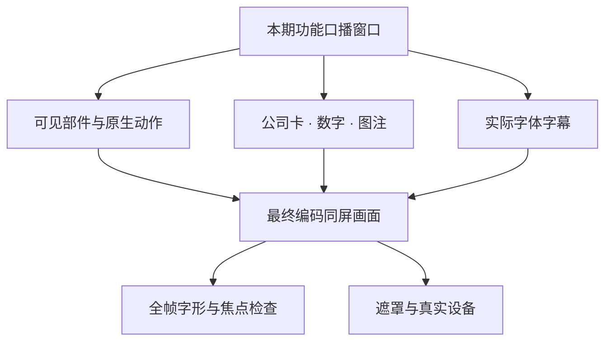

# 用图说明制作方法

以下图片为经选择、重编码和检查的公开展示素材，不包含来源原稿、后台界面、个人音色或账户信息。它们用于说明画面组织；结构与供应关系由每期实际来源另验。

## 1. 展开必须来自一套装配

每个内件在闭合坐标、展开位置和正文近景中拥有同一个语义 ID。展开先让外层避开，内部件再错峰运动；合体回到原装配关系。相机环绕与部件动画共用时间轴。静态示意仅说明层次，不能证明动画连续或真实合体。

| 画面要求 | 实际复核 |
|---|---|
| 层序清楚 | 闭合、最大展开和最大环绕角逐态查看 |
| 讲到的内件实际存在 | 稿段→节点→开场帧→正文近景逐项对应 |
| 标签正确 | 对照最终可见表面，标签与焦点分别核验 |
| 合体可信 | 原生工程保存重开，播放完整收回过程 |

## 2. 细节要有功能和尺度

焊盘、布线、器件、连接落点和边缘层叠应形成可辨的层次。先确认作用及依据，再决定镜头能看清哪些细节。更多随机线条、更多对象和更高分辨率都不能单独证明完成度。微观结构不要画成裸眼可见的同尺度凸块。

## 3. 材料帮助解释装配

壳体应真正让开内部焦点。金属反射、板材、接口和接触阴影帮助观众辨识关系；不同机位需重新检查灯光、尺度和高光。正文讲到功能时，进入同源近景，避免总览中关键部件始终过小。

## 4. 近景兑现口播

讲驱动时看运动传递，讲承力时看连接，讲反馈时看接口。零件与动作数量不代表解释覆盖；记录真实动作区间、末帧保持和静态段。功能逻辑仍需官方技术资料或可说明原理支撑，不能根据这张示意推断真实厂商内部设计。

## 5. 产品图之外，先验最难的同屏组合

每镜头先确定产品焦点，再安排卡片与字幕；用实际字体墨迹测量，不能把大矩形、标签或仅位于屏幕内的锚点当作真实部件可见证据。最终编码、连续音画和真实设备分别留证。

更多要求见[视觉质量基准](visual-quality.md)、[制作 SOP](production-sop.md)和[质量验收](acceptance.md)。
